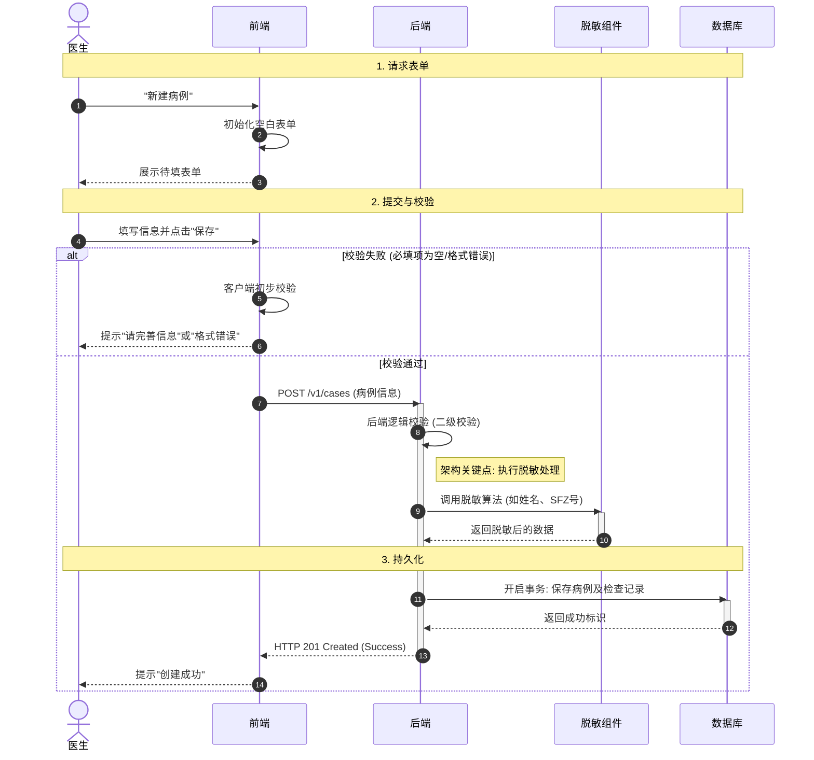
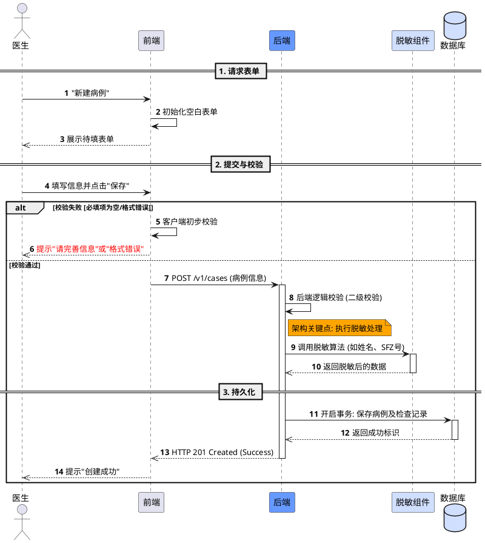
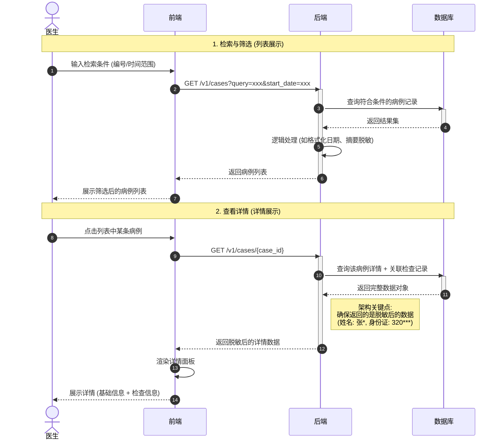
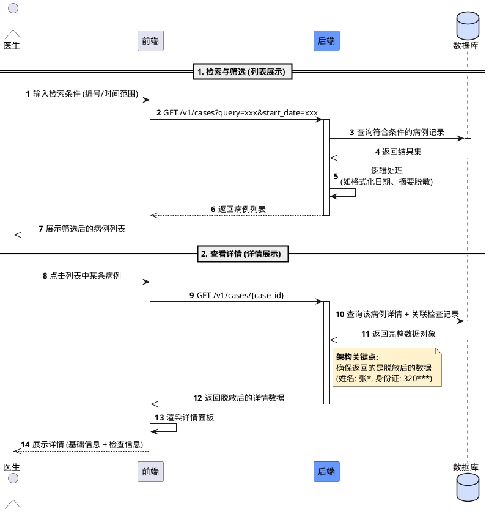
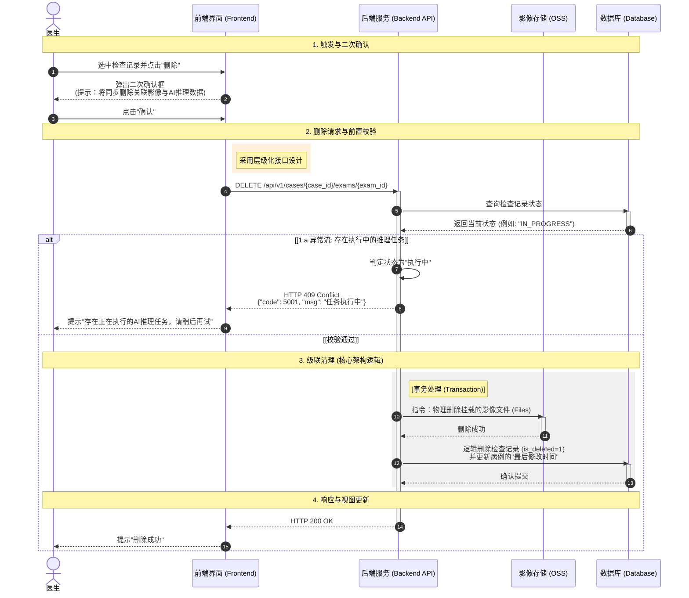
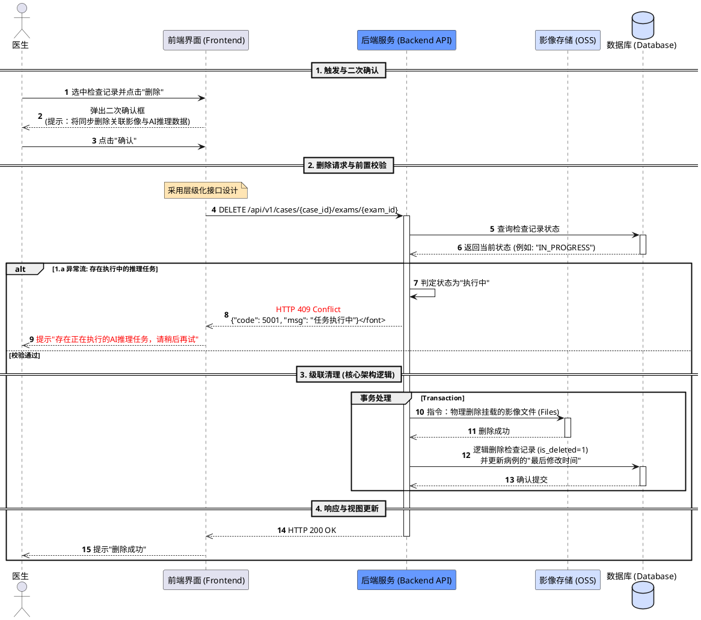
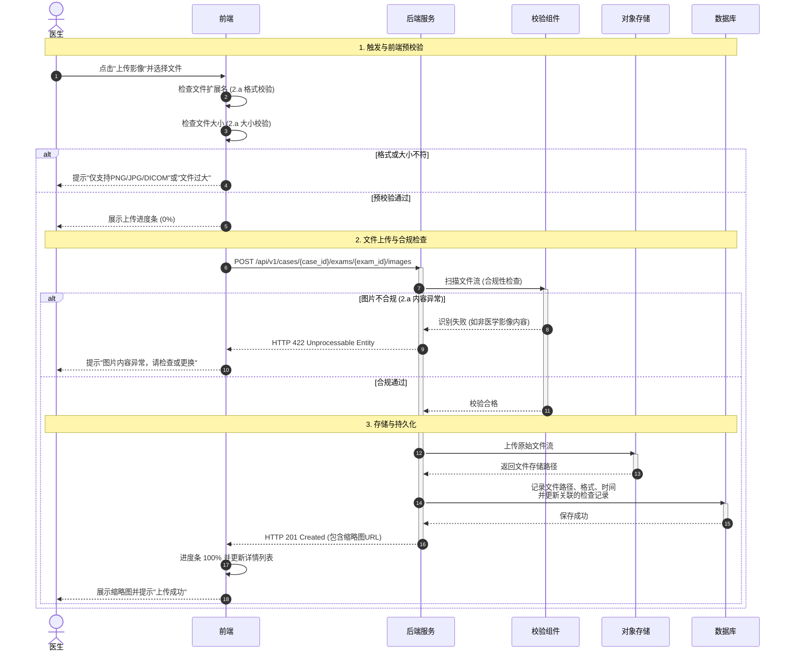
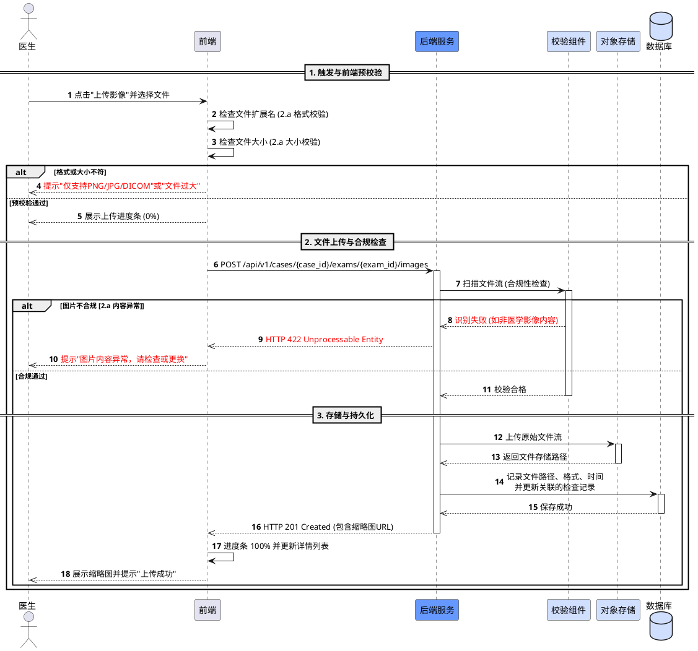
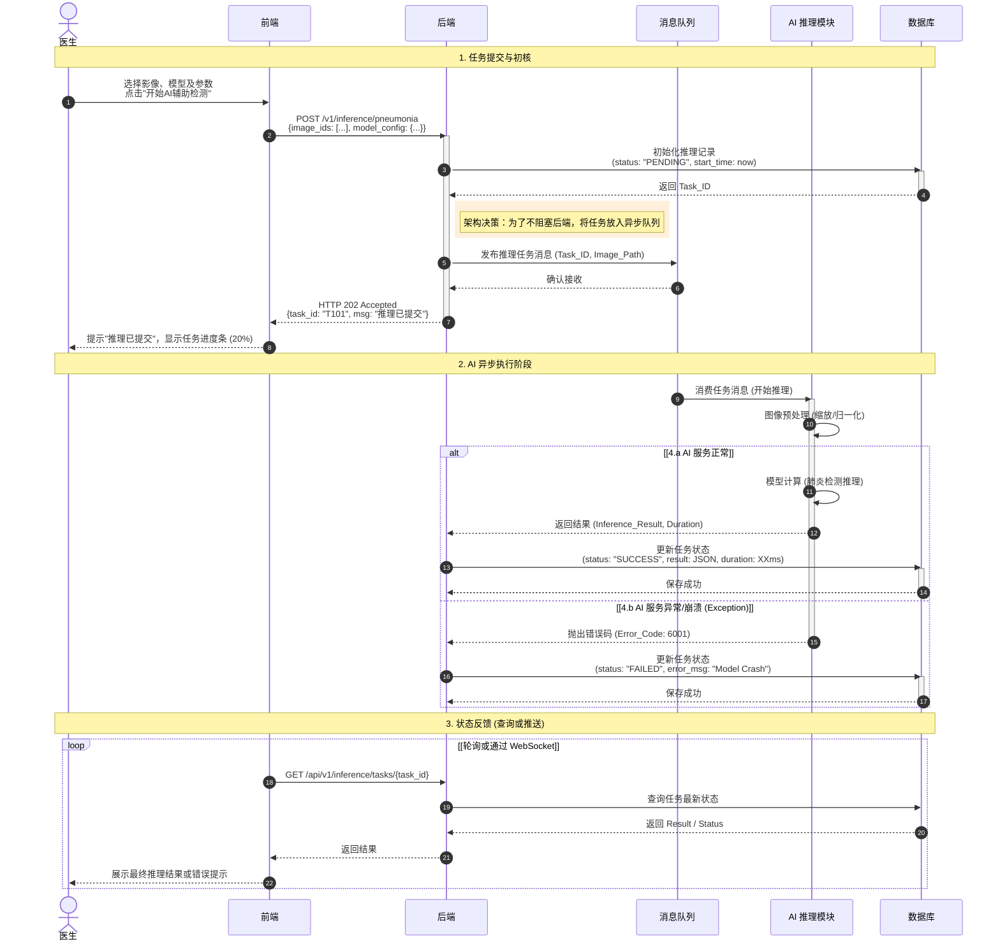
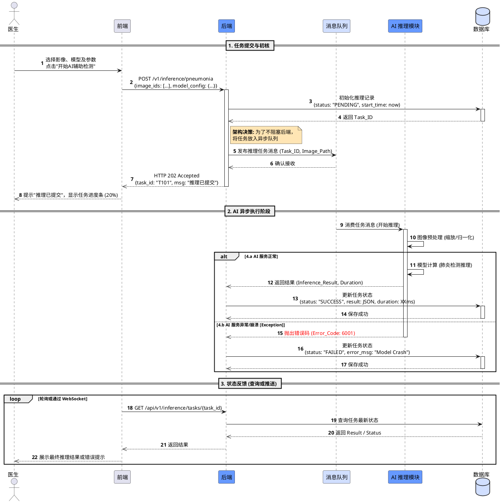

# 时序图 (Sequence Diagram)

## 概述

本文档包含四个核心业务流程的时序图：

1. **医生创建病例**：展示前端校验、后端逻辑、脱敏处理以及数据库持久化的完整流程
2. **病例检索与详情展示**：展示后端对敏感数据的二次处理和脱敏的流程
3. **删除检查记录**：展示异常拦截、OSS 清理和数据库事务的级联删除逻辑
4. **上传影像数据**：展示前端预校验、后端合规性检查、对象存储挂载以及数据库持久化

你可以使用 **PlantUML** 或 **Mermaid.js** 来复现这些时序图。这两种工具在开发者中都非常流行，且易于维护。

---

# 场景一：医生创建病例

## 概述

这个流程展示了一个典型的**医生创建病例**的业务流程，包含了前端校验、后端逻辑、脱敏处理以及数据库持久化。

---

## 1. 使用 Mermaid.js 代码

推荐使用 Mermaid.js，适用于 GitHub/Notion/Obsidian 等平台。

---

## 2. 使用 PlantUML 代码

如果你需要更接近原图的视觉效果（如特定的颜色和布局），可以使用以下代码：

---

## 代码要点解析

### 角色定义
- 使用 `actor`、`participant`、`database` 区分不同层级
- 医生作为系统外部的操作者
- 前端、后端、脱敏组件、数据库作为系统内部组件

### 逻辑分支
- 使用 `alt/else/end` 块来复现图中的校验判断逻辑
- 区分校验失败和校验通过两种情况

### 注释节点
- 使用 `note right of` 来突出图中橙色的"架构关键点"
- 使用 `Note over` 来标注不同的业务阶段

### 颜色控制
- 在 PlantUML 中通过 `#颜色代码`（如 `#6699FF`）来匹配原图中后端的蓝色背景
- 使用 `#D1DFFF` 为脱敏组件和数据库设置浅蓝色背景

---

## 业务流程说明

### 阶段 1：请求表单
1. 医生点击"新建病例"
2. 前端初始化空白表单
3. 展示待填写的表单给医生

### 阶段 2：提交与校验
1. 医生填写信息并点击"保存"
2. 前端进行客户端初步校验
   - 如果校验失败：提示错误信息
   - 如果校验通过：发送请求到后端
3. 后端进行二级校验
4. **架构关键点**：调用脱敏组件处理敏感信息（如姓名、身份证号）

### 阶段 3：持久化
1. 后端开启数据库事务
2. 保存病例及检查记录
3. 数据库返回成功标识
4. 后端返回 HTTP 201 Created
5. 前端提示"创建成功"

---

## 扩展说明

如需将此逻辑转换成其他格式（如具体的后端 API 定义或前端伪代码），可以进一步细化实现细节。

---

# 场景二：病例检索与详情展示

## 概述

这个流程展示了**病例检索与详情展示**的完整流程，重点在于后端对敏感数据的二次处理和脱敏。

---

## 1. 使用 Mermaid.js 代码

Mermaid 语法简洁，非常适合嵌入在 Markdown 文档（如 GitHub、Notion）中。

---

## 2. 使用 PlantUML 代码

如果你需要更接近原图的视觉效果（如特定的蓝色激活条、分段横线），建议使用 PlantUML。

---

## 代码逻辑说明

### 分段标记
- 使用了 `== 阶段名称 ==` 或 `Note over` 来复现图中的灰色水平分割线
- 清晰区分"检索与筛选"和"查看详情"两个阶段

### 激活状态
- 使用 `activate` 和 `deactivate` 来生成后端和数据库处理请求时的蓝色长条（生命线）
- 展示组件在处理请求期间的活跃状态

### 关键点注释
- 使用了 `note right of` 来精确还原图中橙色的架构提醒
- 强调脱敏处理的重要性

### 自动编号
- 添加了 `autonumber`，让流程步骤一目了然
- 便于追踪和讨论具体步骤

---

## 业务流程说明

### 阶段 1：检索与筛选（列表展示）
1. 医生输入检索条件（如病例编号、时间范围）
2. 前端发送 GET 请求到后端：`GET /v1/cases?query=xxx&start_date=xxx`
3. 后端查询数据库，获取符合条件的病例记录
4. 后端进行逻辑处理：
   - 格式化日期
   - 对摘要信息进行脱敏
5. 返回病例列表给前端
6. 前端展示筛选后的病例列表

### 阶段 2：查看详情（详情展示）
1. 医生点击列表中的某条病例
2. 前端发送 GET 请求到后端：`GET /v1/cases/{case_id}`
3. 后端查询该病例的详细信息和关联的检查记录
4. 数据库返回完整数据对象
5. **架构关键点**：后端确保返回的是脱敏后的数据
   - 姓名脱敏：张** → 张*
   - 身份证脱敏：320123199001011234 → 320***
6. 前端接收脱敏后的详情数据
7. 前端渲染详情面板
8. 展示完整的病例详情（基础信息 + 检查信息）

---

## 扩展说明

如需针对这个流程补充具体的脱敏逻辑实现（例如 Java 或 Python 代码），可以进一步细化技术实现细节。

---

# 场景三：删除检查记录

## 概述

这个流程展示了**删除检查记录**的完整业务流程，特别是在处理"正在执行中的任务"时的异常拦截，以及包含对象存储（OSS）和数据库事务的级联删除逻辑。

---

## 1. 使用 Mermaid.js 代码

这是目前最通用的格式，直接复制到支持 Markdown 的编辑器（如 Notion、Obsidian、Typora）即可渲染。

---

## 2. 使用 PlantUML 代码

如果您需要更精细的颜色控制（如还原图中的蓝色激活块和橙色注释），请使用以下代码：

---

## 关键复现点说明

### 状态判定
- 复现了 `alt` 逻辑块，区分了 `HTTP 409` 冲突处理和正常删除流程
- 在删除前先查询检查记录的状态，防止删除正在执行的任务

### 分布式清理
- 体现了后端先调用 **OSS** 进行物理删除，再调用 **Database** 进行逻辑删除的顺序
- 确保影像文件和数据库记录的一致性

### 事务范围
- 使用了 `group` (PlantUML) 或 `rect` (Mermaid) 标注了事务处理的范围
- 保证 OSS 删除和数据库更新的原子性

### RESTful 风格
- 准确还原了 `DELETE` 方法及其层级化路径
- 使用 `/api/v1/cases/{case_id}/exams/{exam_id}` 体现资源的层级关系

---

## 业务流程说明

### 阶段 1：触发与二次确认
1. 医生选中检查记录并点击"删除"按钮
2. 前端弹出二次确认框，提示将同步删除关联影像与 AI 推理数据
3. 医生点击"确认"按钮

### 阶段 2：删除请求与前置校验
1. 前端发送 DELETE 请求：`DELETE /api/v1/cases/{case_id}/exams/{exam_id}`
2. 后端查询检查记录的当前状态
3. 数据库返回状态信息（如 "IN_PROGRESS"）

**异常流程（1.a）：存在执行中的推理任务**
- 后端判定状态为"执行中"
- 返回 HTTP 409 Conflict：`{"code": 5001, "msg": "任务执行中"}`
- 前端提示用户："存在正在执行的 AI 推理任务，请稍后再试"

### 阶段 3：级联清理（核心架构逻辑）
**事务处理流程：**
1. 后端向 OSS 发送指令：物理删除挂载的影像文件
2. OSS 确认删除成功
3. 后端更新数据库：
   - 逻辑删除检查记录（设置 `is_deleted=1`）
   - 更新病例的"最后修改时间"
4. 数据库确认事务提交

### 阶段 4：响应与视图更新
1. 后端返回 HTTP 200 OK
2. 前端提示"删除成功"
3. 前端刷新列表视图，移除已删除的记录

---

## 扩展说明

如需为这个删除流程生成对应的后端 API 异常处理代码（如 Spring Boot 或 Python FastAPI），可以进一步细化技术实现细节。

---

# 场景四：上传影像数据

## 概述

这个流程展示了**上传影像数据**的复杂流程，包含了前端格式/大小预校验、后端合规性检查（内容识别）、对象存储挂载以及数据库持久化。

---

## 1. 使用 Mermaid.js 代码

Mermaid 语法非常适合在 Markdown 环境中使用，逻辑清晰且支持自动布局。

---

## 2. 使用 PlantUML 代码

如果你需要更接近原图的视觉风格（如特定颜色的激活条和注释框），请使用以下代码：

---

## 关键业务点解析

### 双重校验机制
- 图中明确区分了前端的"预校验"（格式/大小）和后端的"合规性校验"（内容识别）
- 在代码中通过嵌套的 `alt` 块体现
- 前端校验提升用户体验，后端校验保证数据安全

### 异步体验
- 前端在发送请求前先展示 `0%` 进度条
- 在收到 `201 Created` 后更新至 `100%`
- 模拟了真实的上传交互体验

### 状态码还原
- 准确使用了 `HTTP 422`（语义错误/内容合规失败）
- 使用 `HTTP 201`（创建成功）
- 符合 RESTful 规范的状态码设计

### 资源解耦
- 流程清晰展示了文件流先经过 `Validator` 校验
- 再流向 `OSS` 存储
- 最后由 `DB` 记录元数据的顺序
- 各组件职责明确，便于维护和扩展

---

## 业务流程说明

### 阶段 1：触发与前端预校验
1. 医生点击"上传影像"并选择文件
2. 前端检查文件扩展名（格式校验）
3. 前端检查文件大小（大小校验）

**异常流程：格式或大小不符**
- 前端提示："仅支持 PNG/JPG/DICOM"或"文件过大"
- 不发送请求到后端，节省带宽

**正常流程：预校验通过**
- 前端展示上传进度条（0%）
- 准备发送文件到后端

### 阶段 2：文件上传与合规检查
1. 前端发送 POST 请求：`POST /api/v1/cases/{case_id}/exams/{exam_id}/images`
2. 后端调用校验组件扫描文件流（合规性检查）

**异常流程：图片不合规（内容异常）**
- 校验组件识别失败（如非医学影像内容）
- 后端返回 HTTP 422 Unprocessable Entity
- 前端提示："图片内容异常，请检查或更换"

**正常流程：合规通过**
- 校验组件返回校验合格
- 进入存储与持久化阶段

### 阶段 3：存储与持久化
1. 后端上传原始文件流到 OSS
2. OSS 返回文件存储路径
3. 后端记录文件元数据到数据库：
   - 文件路径
   - 文件格式
   - 上传时间
   - 更新关联的检查记录
4. 数据库确认保存成功
5. 后端返回 HTTP 201 Created（包含缩略图 URL）
6. 前端更新进度条至 100% 并更新详情列表
7. 前端展示缩略图并提示"上传成功"

---

## 扩展说明

如需为这个流程编写"后端校验组件"或"文件上传接口"的示例代码（如 Spring Boot 或 Python FastAPI），可以进一步细化技术实现细节。

---

# 场景五：AI 推理任务处理流程

## 概述

这个流程展示了一个典型的**异步 AI 推理任务处理流程**。它采用了"生产-消费"模型，通过**消息队列（MQ）解耦前端请求与耗时的后端计算，并使用轮询或 WebSocket** 获取最终结果。

---

## 1. 使用 Mermaid.js 代码

推荐使用 Mermaid.js，渲染速度快，逻辑清晰。

---

## 2. 使用 PlantUML 代码

推荐使用 PlantUML 支持精细样式还原。

---

## 复现重点解析

### HTTP 202 Accepted
这是处理异步任务的标准响应码，表示请求已接受但尚未处理完成，代码中予以保留。

### 解耦设计
代码准确还原了后端将任务投递给 MQ 后即刻返回前端的逻辑，避免了长连接超时。

### 异常分支
复现了 `alt` 块中 AI 模块崩溃后的补偿处理（更新数据库状态为 FAILED），这是系统鲁棒性的体现。

### 状态同步
结尾使用了 `loop` 块复现图中前端获取异步结果的机制（Pull 模型）。

---

## 业务流程说明

### 阶段 1：任务提交与初核
1. 医生选择影像、模型及参数，点击"开始 AI 辅助检测"
2. 前端发送 POST 请求：`POST /v1/inference/pneumonia`
   - 请求体包含：`{image_ids: [...], model_config: {...}}`
3. 后端初始化推理记录到数据库
   - 状态设置为 "PENDING"
   - 记录开始时间
4. 数据库返回 Task_ID
5. **架构决策**：为了不阻塞后端，将任务放入异步队列
6. 后端发布推理任务消息到消息队列（包含 Task_ID 和 Image_Path）
7. 消息队列确认接收
8. 后端返回 HTTP 202 Accepted：`{task_id: "T101", msg: "推理已提交"}`
9. 前端提示"推理已提交"，显示任务进度条（20%）

### 阶段 2：AI 异步执行阶段
1. 消息队列将任务消息推送给 AI 推理模块
2. AI 推理模块开始处理：
   - 图像预处理（缩放/归一化）
   - 模型计算（肺炎检测推理）

**正常流程（4.a AI 服务正常）：**
- AI 模块完成推理计算
- 返回推理结果和执行时长给后端
- 后端更新数据库任务状态：
  - status: "SUCCESS"
  - result: JSON 格式的推理结果
  - duration: 执行时长（毫秒）
- 数据库确认保存成功

**异常流程（4.b AI 服务异常/崩溃）：**
- AI 模块抛出错误码（Error_Code: 6001）
- 后端更新数据库任务状态：
  - status: "FAILED"
  - error_msg: "Model Crash"
- 数据库确认保存成功

### 阶段 3：状态反馈（查询或推送）
1. 前端通过轮询或 WebSocket 查询任务状态
2. 发送 GET 请求：`GET /api/v1/inference/tasks/{task_id}`
3. 后端查询数据库获取任务最新状态
4. 数据库返回结果或状态信息
5. 后端将结果返回给前端
6. 前端展示最终推理结果或错误提示给医生

---

## 扩展说明

如需生成对应的后端任务分发逻辑（如基于 RabbitMQ 或 Kafka 的代码示例），可以进一步细化技术实现细节。
